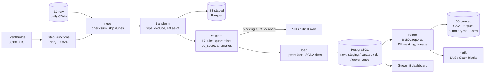

# Financial Reporting & Data Quality Engine

A production-shaped daily pipeline that lands GL postings, cleans and FX-normalises them, runs a governed rule
engine that quarantines bad rows and scores the rest, loads an idempotent star schema in PostgreSQL, runs eight SQL
reports, detects anomalies, and emails an executive summary. Runs end to end on a laptop with Docker Postgres and
`./data`, or on AWS with S3, Lambda, Step Functions, RDS, SNS and CloudWatch via CDK.



## Five-minute quickstart (local)

Prerequisites: Python 3.11, [uv](https://github.com/astral-sh/uv), Docker.

```bash
git clone <this repo> && cd fin-dq-engine
make setup        # venv, deps, pre-commit, docker compose up postgres, migrations
make seed         # generate 600k synthetic postings across 24 months (~1% injected defects), load dims
make run          # run all six stages for RUN_DATE (default 2024-11-13) and print the summary
```

`make run` prints the Markdown summary and writes `out/2024-11-13/summary.md`, `summary.html` (with embedded
charts), `notification.slack.json` and `metrics.jsonl`. Reports land in `data/curated/reports/2024-11-13/` as CSV and
Parquet. A committed example is in [`out/sample/`](out/sample/).

Backfill a range, then open the dashboard:

```bash
make backfill START=2024-09-01 END=2024-11-30
make dashboard
```

Verify everything: `make check` (ruff, mypy strict, pytest with coverage; the DB-backed tests use
`FIN_DQ_TEST_DATABASE_URL`, or start a testcontainers Postgres when Docker is available).

## Repository layout

```
config/           settings.yaml (env overrides FIN_DQ__SECTION__KEY), dq_rules.yaml, data_dictionary.yaml
sql/ddl/          versioned DDL (meta.schema_version), raw/staging/curated/dq/governance schemas, indexes
sql/reports/      one file per report, header metadata drives lineage
sql/quality/      reconciliation.sql
src/fin_dq_engine/
  ingest/ transform/ quality/ load/ reports/ notify/     the six stages
  governance/     audit, lineage, PII masking, retention, secrets
  orchestration/  run_daily / backfill, Lambda handlers
  cli.py          Typer CLI (`fin-dq`)
  synthetic.py    seeded data generator with defect manifest
infra/            CDK app: Storage, Data, Compute, Observability stacks
dashboard/        Streamlit app
tests/            unit (rules, hypothesis, moto, CDK snapshot), integration (end-to-end on 10k seeded rows), golden CSVs
docs/             architecture.md, data_governance_policy.md, runbook.md, explain/ plans
out/sample/       committed example summary, HTML and charts
```

## CLI reference

Every stage is separately invokable; all take `--run-date YYYY-MM-DD` (default: yesterday), `--local/--aws`
(default local) and `--config path`.

| Command | What it does |
|---|---|
| `fin-dq migrate` | Apply `sql/ddl/*.sql` in order, recorded in `meta.schema_version` |
| `fin-dq seed [--events N]` | Generate synthetic raw data into `./data/raw` (0 = reuse) and upsert dims, dim_date, FX history |
| `fin-dq ingest [--force]` | Land the date's files into `raw.*`; skips if the checksum was already processed |
| `fin-dq transform [--batch-id]` | Type, dedupe on `transaction_id`, FX as-of join, write `staging.*` and Parquet |
| `fin-dq validate` | Run the rule engine, quarantine, score, anomaly detection; aborts above the threshold |
| `fin-dq load` | Upsert `curated.fact_transactions`, SCD2 merge `dim_customer`, audit log |
| `fin-dq report` | Run all `sql/reports`, mask PII, write CSV + Parquet + summary, record lineage |
| `fin-dq notify` | Send the summary (SNS in AWS; print + `./out` locally) |
| `fin-dq run-daily [--force] [--no-notify]` | All six stages with timing and metrics |
| `fin-dq run-daily --start A --end B` | Backfill, one run per date, skipping dates without files |
| `fin-dq dq explain --rule-id DQ-010` | Show failing sample rows for a rule on a date |
| `fin-dq dq release --batch-id B [--rule-id]` | Mark quarantined rows as reviewed (audited) |
| `fin-dq lineage show --report ar_aging` | Source tables, batches and rule versions behind a report |
| `fin-dq retention apply [--execute]` | Expire raw/staged/log data past its class limit (dry run by default) |

Settings precedence: CLI flags > environment (`FIN_DQ__DATABASE__URL=...`) > `config/settings.yaml`. In AWS mode the
database URL is read from Secrets Manager (`aws.secret_name`); nothing secret is in the repo.

## Add a rule in three steps

1. **Declare it** in `config/dq_rules.yaml` (id, type, description, dimension, severity, owner, policy section):
   ```yaml
   - id: DQ-018
     type: range
     description: fx_rate must be positive and below 1000
     dimension: validity
     severity: warning
     owner: treasury@example.com
     policy_section: "3.3 Validity"
     params: { column: fx_rate, min: 0.000001, max: 1000 }
   ```
2. **Test it**: add a positive and a negative fixture row to `tests/unit/test_rules.py::CASES` (the fixture batch is
   plain rows in `staging.transactions`).
3. **Ship it**: open a PR; the rule owner approves (see the governance policy). On the next run the engine loads
   version `sha256(definition)[:12]` into `dq.rule_registry`, and lineage rows start recording it.

Need a new **rule type**? Subclass `Rule` in `src/fin_dq_engine/quality/rules.py`, decorate with
`@register_rule("my_type")`, return `(sql, params)` selecting the failing `(staging_row_id, transaction_id)`.
Batch-scoped checks subclass `BatchRule` and implement `check()`.

## Add a report

Drop `sql/reports/my_report.sql` with the header block (`Report`, `Business question`, `Grain`, `Owner`, `Params`,
`Sources`); bind `:run_date`, `:batch_id` or `:late_days` as needed. The runner picks it up, writes CSV + Parquet,
masks PII columns listed in `governance.pii_columns`, and records lineage from the `Sources` line. Add a row-count
assertion to `tests/integration/test_pipeline.py::test_reports_expected_row_counts`; the golden CSV is created on
first run (`UPDATE_GOLDEN=1` to refresh).

## Data quality engine

- **10 rule types**: `not_null`, `unique`, `accepted_values`, `regex_match`, `range`, `referential_integrity`,
  `freshness`, `row_count_delta`, `custom_sql`, `sign_by_account_type`. 17 governed rules ship in `dq_rules.yaml`.
- **Severities**: blocking rows are quarantined with the full row as JSONB and the list of rules they failed; warning
  and info rows load with `dq_score` reduced (20 / 5 per failure, 0 to 100).
- **Abort**: blocking failure rate above `pipeline.batch_failure_threshold_pct` (5%) stops before load and sends a
  critical alert. Curated keeps its last good state.
- **Anomaly detection** (`quality/anomaly.py`): z-score and rolling MAD on daily revenue per entity, Isolation Forest
  on amount / hour / account type / customer tenure trained on the trailing 90 days, Benford first-digit chi-square per
  entity-month, FX day-over-day jumps. Flags carry an explanation payload that the summary turns into plain English.
- **Reconciliation** (`sql/quality/reconciliation.sql`): raw rows = curated + quarantined + duplicates removed, and
  the amounts tie out, for every batch.

## Reports

| Report | Question |
|---|---|
| daily_revenue_by_entity | Revenue, COGS, gross margin per entity per day with 7 and 28 day moving averages |
| ar_aging | Open receivables per customer in 0-30 / 31-60 / 61-90 / 90+ buckets as of the run date |
| gl_trial_balance | Debits vs credits per entity, month and account; flags unbalanced double-entry pairs |
| month_over_month_variance | MoM and YoY change per account with mover ranks over a 13 month spine |
| customer_concentration | Top 10 customers by trailing 12 month revenue, cumulative share, HHI |
| fx_exposure | Unrealised FX on foreign-currency balance sheet positions revalued at the latest rate |
| dq_scorecard | Pass/fail per rule over the last 30 runs, rolled up by dimension and severity |
| late_arriving_data | Rows arriving more than N days after their accounting date, by source system |

Two query optimisations with before/after EXPLAIN ANALYZE, and a PostgreSQL 16 planner bug the tests now guard
against, are documented in [docs/architecture.md](docs/architecture.md#query-optimisation).

## Governance

Data dictionary enforced by test, PII masked unless `role: finance_admin` (every unmasked access logged), lineage per
report, audit log on every write, retention by class with dry-run, and a versioned rule registry with change
control. See [docs/data_governance_policy.md](docs/data_governance_policy.md).

## Deployment (AWS)

```bash
export AWS_ACCOUNT_ID=123456789012 AWS_REGION=us-east-1
npx aws-cdk@2 bootstrap aws://$AWS_ACCOUNT_ID/$AWS_REGION      # once per account/region
make deploy                                                    # docker build + push to ECR, then cdk deploy --all
```

`make deploy` builds the Lambda container image, pushes it to ECR and runs `cdk deploy --all` with the image tag as
context. Stacks:

| Stack | Resources |
|---|---|
| fin-dq-storage | 3 versioned, encrypted S3 buckets (raw 400 d, staged 90 d, curated to IA after 90 d) |
| fin-dq-data | VPC (isolated subnets + endpoints, no NAT), RDS PostgreSQL 16 `db.t4g.micro`, Secrets Manager secret |
| fin-dq-compute | ECR repo, 6 container Lambdas (one per stage), Step Functions with retry/catch to a failure topic, EventBridge cron `0 6 * * ? *`, alerts topic |
| fin-dq-observability | Alarms: `dq_pass_rate < 0.95`, any `stage_failure`, state machine failed, per-function errors; dashboard |

The pipeline role can read raw, read/write staged and curated, publish to one topic, read one secret and put metrics
in one namespace. Nothing else. `tests/unit/test_cdk_snapshot.py` snapshots the resource inventory and asserts
encryption, versioning, schedule and no wildcard actions.

Set `alert_email` in `infra/cdk.json` or `-c alert_email=...`; confirm the SNS subscription email after the first
deploy. To trigger a run manually: start the `fin-dq-daily` state machine with `{"run_date": "2025-03-05"}`.

### Estimated monthly AWS cost (us-east-1, daily run, ~1k rows/day)

| Item | Assumption | USD / month |
|---|---|---|
| RDS PostgreSQL db.t4g.micro, 20 GB gp3, 7 day backups | on-demand, single AZ | ~14 |
| Lambda | 6 invocations/day, 1 to 3 GB, ~40 s total compute/day | < 1 |
| Step Functions | 6 transitions/day (standard) | < 1 |
| S3 | ~10 GB across three buckets, low request volume | < 1 |
| VPC interface endpoints | 6 endpoints x 2 AZs x $0.01/h | ~88 |
| CloudWatch | 12 alarms, 1 dashboard, custom metrics, logs | ~8 |
| SNS, Secrets Manager, ECR | 1 secret, 1 image, few emails | ~2 |
| **Total** | | **~115** |

The interface endpoints dominate. Alternatives: a single NAT gateway (~33 plus data) or running the Lambdas outside
the VPC against a publicly reachable RDS with strict security groups (~25 total). Reserved RDS pricing cuts the
database cost further.

## Testing

```bash
make test                 # everything with coverage (threshold 85%)
make test-unit            # pure unit tests, moto, hypothesis, CDK snapshot
make test-integration     # end-to-end on a seeded 10k-row dataset
UPDATE_GOLDEN=1 make test-integration     # refresh golden report CSVs
UPDATE_SNAPSHOT=1 pytest tests/unit/test_cdk_snapshot.py
```

The integration suite seeds ~10k posting legs with a known defect manifest, runs eight daily pipelines and asserts
exact per-rule quarantine counts, reconciliation, a balanced trial balance (every unbalanced event is explained by a
quarantined or sign-flipped leg), report row counts, lineage/PII/audit rows, idempotent re-runs (with and without
`--force`), SCD2 versions, anomaly flags, the abort path, and golden CSV equality.

## Resume mapping

| Statement | Where it is real in this repo |
|---|---|
| "Built a daily financial data pipeline on AWS (S3, Lambda, Step Functions, RDS PostgreSQL) with IaC in CDK, idempotent stages and automated retries and alerting." | `infra/stacks/*.py` (4 stacks, least-privilege IAM, retry/catch, EventBridge), `orchestration/runner.py` and `lambda_handlers.py`, idempotency table in `docs/architecture.md`, `test_idempotent_rerun_leaves_curated_unchanged` |
| "Designed a rule-driven data quality engine with 10 rule types, severity-based quarantine, row-level quality scores and statistical anomaly detection (z-score, Isolation Forest, Benford)." | `quality/rules.py`, `quality/engine.py`, `quality/scoring.py`, `quality/anomaly.py`, `config/dq_rules.yaml`, 21 parametrised rule tests plus hypothesis properties |
| "Authored the financial reporting layer: star schema with SCD Type 2 dimensions and eight SQL reports (trial balance, AR aging, FX exposure, MoM variance) with EXPLAIN-driven optimisation." | `sql/ddl/004_curated.sql`, `load/load.py::merge_customers_scd2`, `sql/reports/*.sql`, `docs/architecture.md#query-optimisation` with before/after plans in `docs/explain/` |
| "Implemented data governance: enforced data dictionary, PII masking with access logging, column-level lineage, audit trail, retention policies and a versioned rule registry with change control." | `config/data_dictionary.yaml` + `test_data_dictionary.py`, `governance/pii.py`, `governance/lineage.py`, `governance/audit.py`, `governance/retention.py`, `dq.rule_registry`, `docs/data_governance_policy.md` |

## Design notes

- Amounts are signed (debit positive, credit negative) and every business event produces a debit and a credit leg
  sharing `event_id`; the trial balance checks `SUM = 0` per event, so quarantined legs surface as visible imbalances
  rather than silently vanishing.
- Rules are SQL predicates generated by Python classes, so they run where the data is and stay readable in
  `dq.rule_registry.params`; identifiers from config are whitelisted before they touch SQL.
- Storage, metrics and notification are the only components that know whether they are local or in AWS. Everything
  else takes an engine and a storage object, which is what makes the integration suite run against plain Postgres.
- The sandbox this was built in had no Docker, so Postgres 16 was installed from apt and the tests were pointed at it
  through `FIN_DQ_TEST_DATABASE_URL`; the testcontainers path, `docker compose` and `cdk deploy` are exercised by CI
  and a real AWS account, not by that run.
