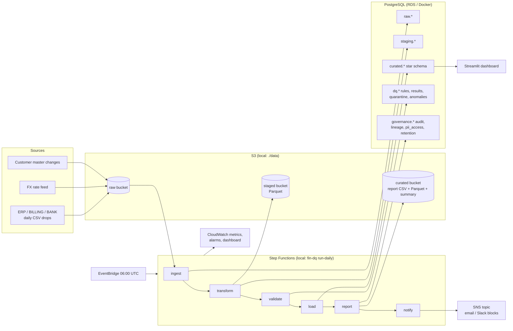
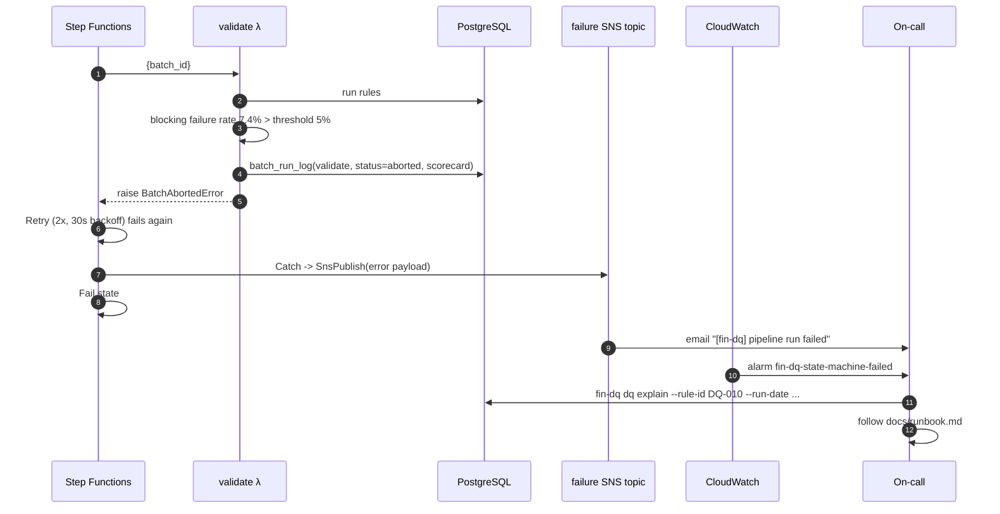
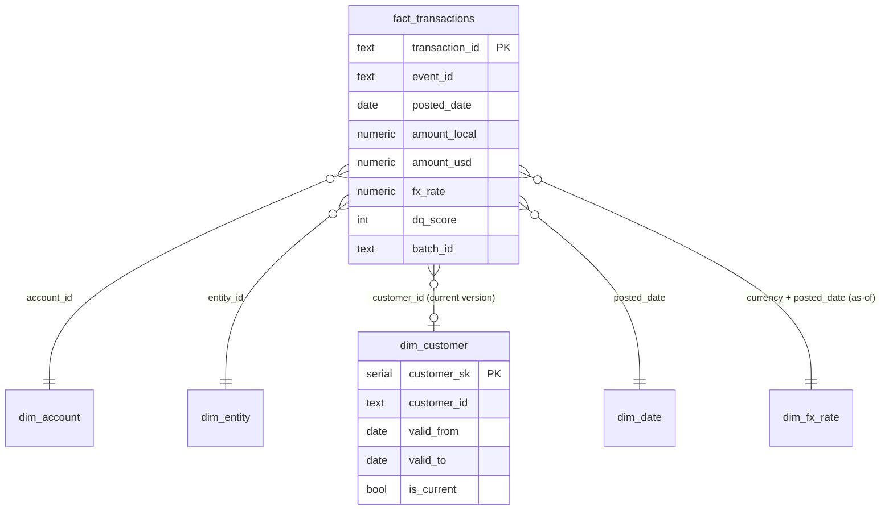

# Architecture

## Components



Every stage is a pure function of `(settings, engine, batch_id, run_date)` in `src/fin_dq_engine/<stage>/`. The same
functions are called by the Typer CLI (`fin_dq_engine/cli.py`), the local orchestrator
(`orchestration/runner.py`) and the Lambda handlers (`orchestration/lambda_handlers.py`). Only the storage backend
(`storage.py`), the metrics sink (`metrics.py`) and the notifier (`notify/notify.py`) branch on `environment`.

## Daily run

```mermaid
sequenceDiagram
    autonumber
    participant EB as EventBridge (06:00 UTC)
    participant SF as Step Functions
    participant IN as ingest λ
    participant TR as transform λ
    participant VA as validate λ
    participant LO as load λ
    participant RE as report λ
    participant NO as notify λ
    participant S3
    participant PG as PostgreSQL
    participant SNS

    EB->>SF: start {}
    SF->>IN: {run_date: yesterday}
    IN->>S3: read raw/transactions/{date}.csv, fx_rates, customers
    IN->>PG: checksum lookup in dq.batch_run_log
    alt checksum already ingested
        IN-->>SF: {batch_id, skipped: true}
    else new batch
        IN->>PG: COPY raw.* with _ingested_at/_source_file/_batch_id, batch_run_log(ingest)
        IN-->>SF: {batch_id}
    end
    SF->>TR: {batch_id}
    TR->>PG: read raw, upsert dim_fx_rate, stage customers
    TR->>TR: cast types, dedupe on transaction_id, FX as-of join (pandas)
    TR->>PG: replace staging.transactions for batch
    TR->>S3: staged/transactions/run_date=.../{batch}.parquet
    SF->>VA: {batch_id}
    VA->>PG: sync dq.rule_registry from dq_rules.yaml (versioned)
    VA->>PG: run 17 rules, write dq.rule_results (+20 sample keys)
    VA->>PG: quarantine blocking failures, set dq_score
    VA->>PG: z-score/MAD, Isolation Forest, Benford, FX jump -> dq.anomaly_flags
    VA-->>SF: {scorecard}
    SF->>LO: {batch_id}
    LO->>PG: BEGIN; SCD2 merge dim_customer; INSERT ... ON CONFLICT fact_transactions; audit_log; COMMIT
    SF->>RE: {batch_id}
    RE->>PG: run sql/reports/*.sql, mask PII, log pii_access, write governance.lineage
    RE->>S3: curated/reports/{date}/*.csv|parquet, summary.md|html, charts
    SF->>NO: {batch_id}
    NO->>SNS: publish Markdown summary
```

## Failure path



Load never runs for an aborted batch, so `curated.*` keeps the previous good state. Re-running the date after the
source is fixed produces a new checksum and therefore a new batch id; the aborted batch stays in `dq.batch_run_log`
and `dq.quarantine` for audit.

## Idempotency model

| Stage | Key | Re-run behaviour |
|---|---|---|
| ingest | sha256 of all source files for the date | skipped if a successful ingest has the same checksum (`--force` overrides) |
| transform | batch_id | staging rows for the batch are deleted and rewritten |
| validate | batch_id | rule_results, quarantine, anomaly_flags for the batch are deleted and rewritten |
| load | transaction_id | `INSERT ... ON CONFLICT DO UPDATE`; SCD2 merge only closes a version when attributes differ |
| report | (report, run_date) | files overwritten, a new lineage row is appended |

`tests/integration/test_pipeline.py::test_idempotent_rerun_leaves_curated_unchanged` proves it.

## Query optimisation

Measured on PostgreSQL 16.15 with 66,040 fact rows (81 backfilled days). Raw plans are in `docs/explain/`.

### 1. gl_trial_balance: rewrite two window functions into GROUP BY + HAVING (before/after)

The original computed `SUM(amount_usd) OVER (PARTITION BY event_id)` and `COUNT(*) OVER (PARTITION BY event_id)` for
every leg, which forced a sort of all 66k rows by `event_id` that spilled to disk:

```
->  WindowAgg  (actual time=68.613..157.362 rows=66040)
      ->  Sort  Sort Key: f.event_id   Sort Method: external merge  Disk: 3496kB
Execution Time: 222.846 ms
```

Rewritten to aggregate per event once (`GROUP BY event_id HAVING ABS(SUM(...)) > 0.005 OR COUNT(*) % 2 = 1`) and
LEFT JOIN the few unbalanced events back onto the legs:

```
->  HashAggregate  Group Key: scoped.event_id  Batches: 1  Memory Usage: 4497kB
->  Hash Left Join  Hash Cond: (s.event_id = e.event_id)
Execution Time: 153.713 ms
```

Same 1,607 output rows (md5 of the sorted result set identical), 31% faster, no temp files. The window version is
kept in git history; the report file documents the change in its header.

### 2. ar_aging: composite index on (account_id, posted_date)

AR aging touches only the receivables account (`account_code = '1100'`, about 25% of legs). With
`ix_fact_account_date` the planner uses a bitmap index scan; without it, a sequential scan of the whole fact table:

| | plan on fact_transactions | execution time |
|---|---|---|
| with `ix_fact_account_date` | Bitmap Index Scan -> Bitmap Heap Scan (16,487 rows) | 51.3 ms |
| without | Seq Scan (66,040 rows) | 61.8 ms |

The gain is modest at 66k rows because the table fits in shared buffers; the point of the index is that the report's
cost grows with AR volume rather than with total GL volume as the table reaches tens of millions of rows.

### 3. month_over_month_variance (second heaviest, 73 ms)

Uses a 24-month spine from `dim_date` so `LAG(net_usd, 12)` compares against a real month even when an account had
no postings; all sorts are in memory (`Sort Method: quicksort`). The spine cross join is 120 accounts x 25 months and
dominates planning, not execution. No change needed at this scale.

### PostgreSQL run-condition pitfall

`customer_concentration.sql` originally combined `RANK() OVER (ORDER BY ...)` and
`SUM(...) OVER (ORDER BY ... ROWS UNBOUNDED PRECEDING)` in one CTE and filtered `WHERE revenue_rank <= 10` outside.
PostgreSQL 16 turns `rank() <= 10` into a *window run condition*; with two window clauses that differ only in frame
the planner emits a single WindowAgg and drops the predicate, returning every customer. Minimal repro:

```sql
WITH r AS (SELECT g AS v FROM generate_series(1,50) g),
ranked AS (SELECT v, RANK() OVER (ORDER BY v DESC) AS rk,
                  SUM(v) OVER (ORDER BY v DESC ROWS UNBOUNDED PRECEDING) AS cum FROM r)
SELECT count(*) FROM ranked WHERE rk <= 10;   -- returns 50 on 16.15, expected 10
```

The report now computes `RANK()` in its own CTE. `tests/integration/test_pipeline.py::test_reports_expected_row_counts`
asserts the report returns exactly 10 rows so a regression is caught.

## Data model



Amounts are signed: debit positive, credit negative. Every business event produces a debit leg and a credit leg
sharing `event_id`, so `SUM(amount_usd) = 0` per event is the invariant the trial balance checks.
